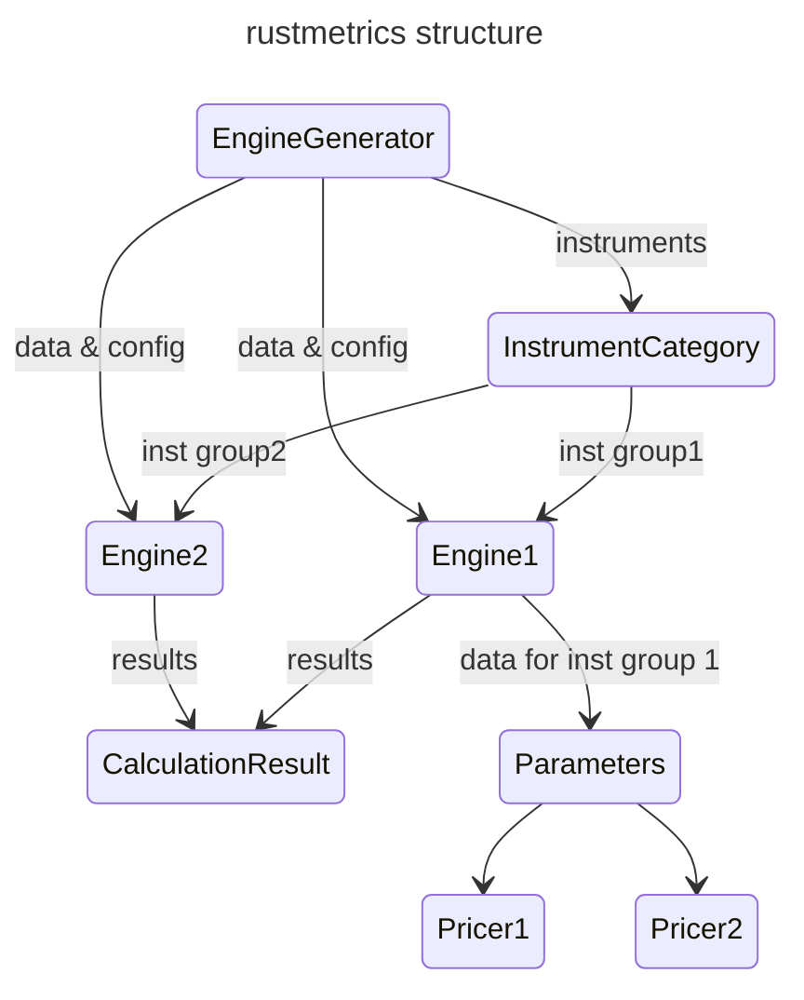

# rustmetrics

`rustmetrics` is a Rust crate for pricing financial instruments and calculating various risk metrics. This crate aims to provide efficient and optimized calculations for a wide range of financial risk measures.

## Features

- Pricing and risk calculation for plain financial instruments:
  - Bonds
  - Cross-Currency Swaps (CRS)
  - Interest Rate Swaps (IRS)
  - Futures
  - Vanilla Options
  - Korea Treasury Bond Futures (KTBF)
  - FX Swaps
  - FX Forwards
  - FX Spots

- Calculation of key risk metrics:
  - Delta
  - Gamma
  - Theta
  - Vega
  - Vega Structure
  - Vega Matrix
  - Rho
  - Rho Structure
  - Dividend Delta
  - Dividend Structure

## Design Philosophy

The core design of `rustmetrics` focuses on optimizing calculations by reducing repetitive and redundant operations. This is achieved through two main components:

1. **InstrumentCategory**: Categorizes financial instruments based on their characteristics.

2. **EngineGenerator**: Splits instruments into groups and creates specialized engines for each group. This approach significantly reduces duplicate work, such as performing curve bumps only once per engine.

This design provides a solid foundation for future expansions, particularly for implementing numerical simulations like Finite Difference Methods (FDM) and Monte Carlo simulations, where reusing paths and decomposed matrices can lead to substantial performance improvements.

## Current Status

This crate is currently in its first prototype stage. While it can handle basic plain instruments, it is actively under development with plans for expansion and optimization.

## Future Plans

- Implement more complex financial instruments
- Add support for numerical simulations (FDM, Monte Carlo)
- Optimize performance for large-scale calculations
- Expand the range of supported risk metrics

## Contributing

We welcome all contributions! Whether it's comments, minor changes, or structural code modifications, we're eager to review your input. Here's how you can contribute:

- Open an issue for any bugs you find or features you'd like to see.
- Submit a pull request for any improvements you've made.
- Provide feedback on existing issues and pull requests.

No contribution is too small, and all input is valued. Let's work together to make this project even better!

## License

This project is licensed under either of

 * Apache License, Version 2.0, ([LICENSE-APACHE](LICENSE-APACHE) or http://www.apache.org/licenses/LICENSE-2.0)
 * MIT license ([LICENSE-MIT](LICENSE-MIT) or http://opensource.org/licenses/MIT)

at your option.
## Contact

For questions, suggestions, or contributions, please contact:

Junbeom Lee: junbeoml22@gmail.com

---

We believe this approach has significant potential and look forward to your contributions in making `rustmetrics` a powerful tool for financial risk analysis in Rust.
## Overview
For standard examples, see [./tests/engine.rs](./tests/engine.rs)
## Crate structure

| Module | Description |
| ------ | ----------- |
| [data](./src/data) | Raw market observations, which are not directly used for calculation.    Data is shared by Engine object in multi-thread environment|
| [parameters](./src/parameters) | Objects generated from data objects for actual calculation |
| [instruments](./src/instruments) | ex) Futures, FxFutures, FxForward, FxSwap, VanillaOption, IRS, CCS, Bond, KtbFutures|
| [time](./src/time) | Calendars, conventions, handling holiday |
| [pricing_engines](./src/pricing_engines) | Engine, EngineGenerator, and Pricer |

| Struct | Description |
|------- | ----------- |
|[CalculationConfiguration](./src/pricing_engines/calculation_configuration.rs) | All information for pricing: delta bump ratio, gap days for theta calculation, etc
| [Pricer](./src/pricing_engines/pricer.rs) | Enum containing pricers for each [Instrument](./src/instrument.rs) |
| [Engine](./src/pricing_engines/engine.rs) | An Engine takes data as Arc objects and creates parameters such as [ZeroCurve](./src/parameters/zero_curve.rs), [DiscreteRatioDividend](./src/parameters/discrete_ratio_dividend.rs), etc. The parameters, as Rc<RefCell<..>> objects, are shared only inside the Engine. Then the Engine excutes Pricers repeatedly for calculating risks, e.g., delta, gamma, theta, rho, etc|
| [CalculationResult](./src/pricing_engines/calculation_result.rs)| price, greeks, cashflows |
| [EngineGenerator](./src/pricing_engines/engine_generator.rs) | EngineGnerator groups instruments according to [InstrumentCategory](./src/pricing_engines/engine_generator.rs), then [Engine](./src/pricing_engines/engine.rs)s are created for each group of instruments. The purpose of separation is mmainly for compuation performance. This is especially useful for Monte-Carlo simulation (not yet developed) since the most of the computation cost in MC simulation is caused by path generation. |

