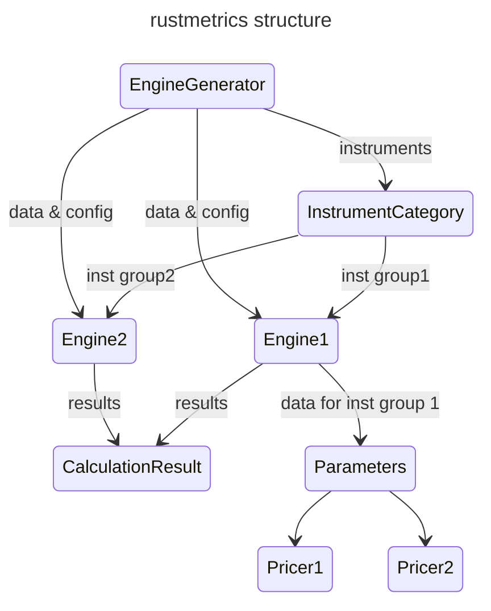

# RustMetrics

## A Pricing and risk engine

## Overview

## Crate structure

| Module | Description |
| ------ | ----------- |
| [data](./src/data) | Raw market observations, which are not directly used for calculation.    Data is shared by Engine object in multi-thread environment|
| [parameters](./src/parameters) | Objects generated from data objects for actual calculation |
| [instruments](./src/instruments) | ex) Futures, FxFutures, FxForward, FxSwap, VanillaOption, IRS, CCS, Bond, KtbFutures|
| [time](./src/time) | Calendars, conventions, handling holiday |
| [pricing_engines](./src/pricing_engines) | Engine, EngineGenerator, and Pricer |

| Struct \& Enum | Description |
|------- | ----------- |
|[CalculationConfiguration](./src/pricing_engines/calculation_configuration.rs) | All information for pricing: delta bump ratio, gap days for theta calculation, etc
| [Pricer](./src/pricing_engines/pricer.rs) | Enum containing pricers for each [Instrument](./src/instrument.rs) |
| [Engine](./src/pricing_engines/engine.rs) | An Engine takes data as Arc objects and creates parameters such as [ZeroCurve](./src/parameters/zero_curve.rs), [DiscreteRatioDividend](./src/parameters/discrete_ratio_dividend.rs), etc. The parameters, as Rc<RefCell<..>> objects, are shared only inside the Engine. Then the Engine excutes Pricers repeatedly for calculating risks, e.g., delta, gamma, theta, rho, etc|
| [CalculationResult](./src/pricing_engines/calculation_result.rs)| price, greeks, cashflows |
| [EngineGenerator](./src/pricing_engines/engine_generator.rs) | EngineGnerator groups instruments according to [InstrumentCategory](./src/pricing_engines/engine_generator.rs), then [Engine](./src/pricing_engines/engine.rs)s are created for each group of instruments. The purpose of separation is mmainly for compuation performance. This is especially useful for Monte-Carlo simulation (not yet developed) since the most of the computation cost in MC simulation is caused by path generation. |

